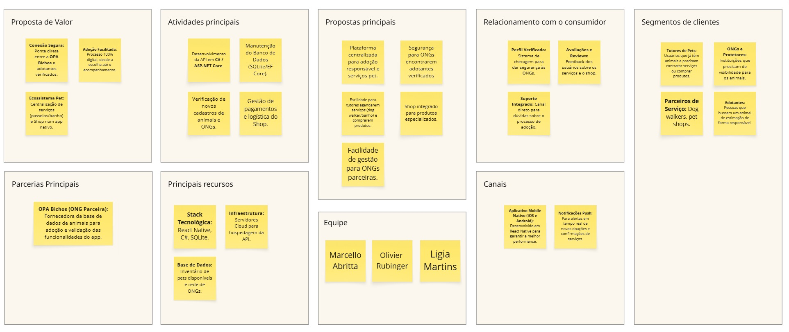
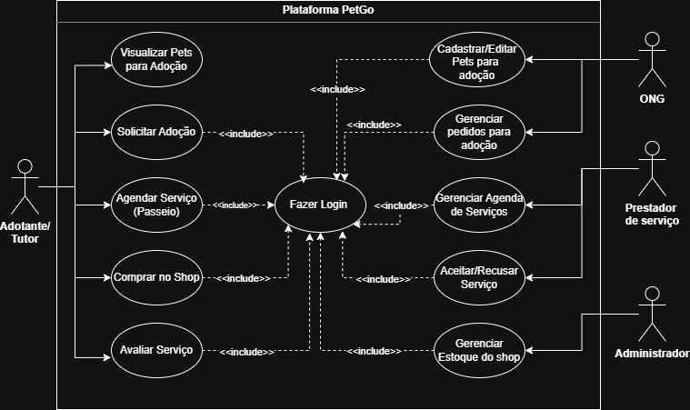
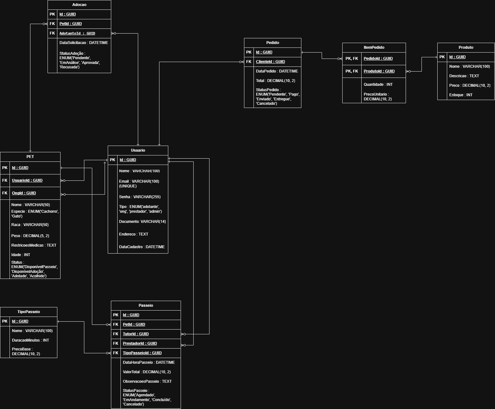

# Especificações do Projeto

A especificação do projeto detalha a solução proposta para o problema apresentado na documentação de contexto, descrevendo as funcionalidades, requisitos e estrutura tecnológica da aplicação **PetGo**. Esta etapa define os componentes do sistema necessários para atender tutores, prestadores de serviços e organizações de proteção animal exclusivamente em ambiente mobile.

## Arquitetura e Tecnologias

A plataforma PetGo utiliza uma arquitetura cliente-servidor focada em dispositivos móveis, garantindo portabilidade, alto desempenho e facilidade de manutenção.

### Frontend (Mobile)

Responsável pela interface e experiência do usuário (UX) em smartphones, unificando a jornada de tutores, ONGs e prestadores.

* **Tecnologias:** React Native, Expo, TypeScript 5.
* **Estilização:** NativeWind (Tailwind CSS para Mobile).
* **Bibliotecas:** React Navigation, React Query, React Hook Form, Zod (validação), Axios (HTTP), Lucide React Native (ícones).
* **Build/Deploy:** Expo Application Services (EAS).

### Backend (API REST)

Gerencia as regras de negócio, o fluxo de agendamento de passeios, doações, e-commerce e as comunicações com o banco de dados, hospedado na plataforma **Railway**.

* **Tecnologias:** C#, ASP.NET Core 9.0, Entity Framework Core 9.0 (ORM).
* **Documentação:** Swagger/OpenAPI.
* **Produção:** [https://petgo-production.up.railway.app/swagger]

### Banco de Dados

* **Tecnologia:** Supabase PostgreSQL 15.
* **Recursos:** Utilização de UUID (GUID) para chaves primárias e relacionamentos complexos, garantindo integridade de dados para transações e histórico de adoções.

## Project Model Canvas

## Requisitos

A priorização utiliza a técnica **MoSCoW** (Must Have, Should Have, Could Have).

### Requisitos Funcionais (RF)

| ID | Descrição do Requisito | Prioridade |
| --- | --- | --- |
| RF-001 | Permitir cadastro e perfil de usuários (Adotante, ONG e Prestador) | ALTA |
| RF-002 | Permitir autenticação via JWT com biometria ou senha | ALTA |
| RF-003 | Permitir agendamento de passeios (Dog Walking) direto pelo app | ALTA |
| RF-004 | Exibir catálogo de produtos e realizar checkout de compras | ALTA |
| RF-005 | Permitir visualização de pets para adoção com filtros por espécie | ALTA |
| RF-006 | Permitir que ONGs gerenciem seus pets disponíveis para adoção | ALTA |
| RF-007 | Permitir notificações push sobre status de passeios e pedidos | MÉDIA |
| RF-008 | Permitir sistema de avaliações de prestadores de serviço | MÉDIA |

### Requisitos Não Funcionais (RNF)

| ID | Descrição do Requisito | Prioridade |
| --- | --- | --- |
| RNF-001 | O aplicativo deve ser Cross-platform (Android e iOS) via React Native | ALTA |
| RNF-002 | O tempo de resposta das requisições deve ser inferior a 3 segundos | MÉDIA |
| RNF-003 | O sistema deve garantir a segurança de dados sensíveis (LGPD) | ALTA |
| RNF-004 | A API deve possuir documentação acessível via Swagger | ALTA |
| RNF-005 | O sistema deve permitir deploy contínuo automatizado (CI/CD) | MÉDIA |

## Restrições

| ID | Restrição |
| --- | --- |
| 01 | O projeto deverá ser entregue até o final do semestre letivo |
| 02 | O desenvolvimento será realizado exclusivamente pela equipe de alunos |
| 03 | A integração com a ONG será focada na divulgação e adoção de pets da **OPA Bichos** |
| 04 | O projeto deve utilizar ferramentas gratuitas ou acadêmicas |

## Diagrama de Casos de Uso

## Modelo ER (Projeto Conceitual)

## Projeto da Base de Dados

### Estrutura das Tabelas (Schema)

* **Usuario:** id (GUID), nome, email, senha, tipo (Enum: adotante, ong, prestador, admin).
* **Pet:** id (GUID), usuario_id (FK), ong_id (FK), nome, especie (Enum: Cachorro, Gato), status (Enum).
* **PasseioAgendado:** id (GUID), pet_id (FK), tutor_id (FK), prestador_id (FK), data_hora, valor.
* **Produto:** id (GUID), nome, preco, estoque_atual.
* **Pedido:** id (GUID), cliente_id (FK), valor_total, status_pedido (Enum).
* **ItemPedido:** id (GUID), pedido_id (FK), produto_id (FK), quantidade, preco_unitario.
* **Adocao:** id (GUID), pet_id (FK), adotante_id (FK), status_adocao (Enum).

## Personas e Histórias de Usuário

* **Persona 1 (Tutor):** Mariana Souza (29 anos). Deseja agendar passeios rápidos via app enquanto está no trabalho.
* **Persona 2 (Prestador):** Carlos Mendes (34 anos). Usa o celular para gerenciar sua agenda de serviços e rotas de passeio.
* **Persona 3 (ONG):** Juliana Ferreira (38 anos). Focada em aumentar o alcance das adoções da **ONG OPA Bichos**.

### Matriz de Rastreabilidade

| Requisito | História de Usuário (US) | Descrição Resumida |
| --- | --- | --- |
| RF-003 | US01 | Agendamento de passeios para pets de tutores |
| RF-004 | US02 | Compra de mantimentos e acessórios via e-commerce |
| RF-006 | US03 | Divulgação de pets para adoção pela **OPA Bichos** |
| RF-008 | US04 | Avaliação da qualidade do serviço prestado pelo Dog Walker |

## Gerenciamento do Projeto

### Cronograma e DevOps

O desenvolvimento segue as etapas de Planejamento, Modelagem, Desenvolvimento, Testes e Entrega Final. A qualidade é garantida via:

* **Versionamento:** Git e GitHub com CI/CD.
* **Padronização:** ESLint, Prettier e Husky.

### Custos e Recursos Humanos

O projeto utiliza tecnologias *open-source* de custo zero (nível acadêmico). A equipe é composta por estudantes divididos entre design mobile, desenvolvimento frontend (React Native), backend (C#/.NET), banco de dados e documentação.
