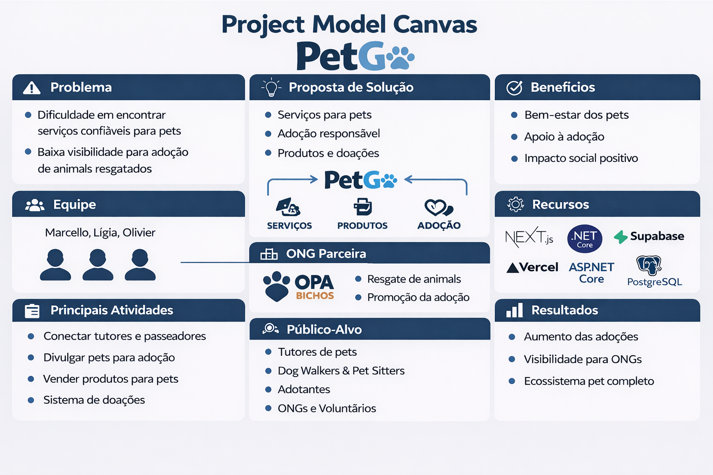
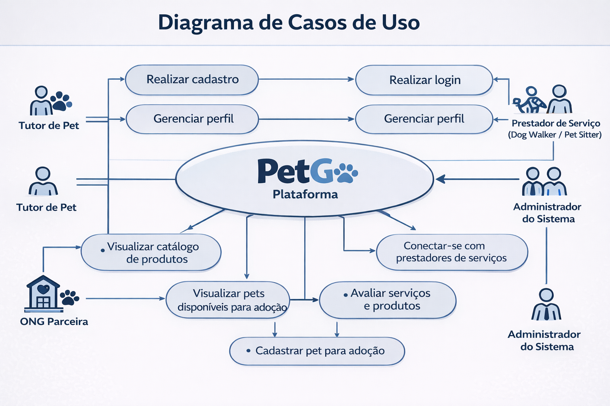

# Especificações do Projeto

A especificação do projeto detalha a solução proposta para o problema apresentado na documentação de contexto, descrevendo as funcionalidades, requisitos e estrutura tecnológica da aplicação PetGo. Esta etapa define os componentes do sistema necessários para atender tutores, prestadores de serviços e organizações de proteção animal.

## Arquitetura e Tecnologias

A plataforma PetGo utiliza uma arquitetura cliente-servidor, com separação clara entre frontend, backend e banco de dados, garantindo escalabilidade e facilidade de manutenção.

# Frontend

Responsável pela interface e experiência do usuário (UX), hospedado na plataforma **Vercel**.

* **Tecnologias:** Next.js 15, React, TypeScript 5, Tailwind CSS 4.
* **Bibliotecas:** React Query (estado), React Hook Form (formulários), Zod (validação), Axios (HTTP), Lucide React (ícones).
* **Produção:** [https://pet-go-puc.vercel.app](https://pet-go-puc.vercel.app)

### Backend (API REST)

Gerencia as regras de negócio e a comunicação com o banco de dados, hospedado na plataforma **Railway**.

* **Tecnologias:** ASP.NET Core 9.0, Entity Framework Core 9.0 (ORM).
* **Documentação:** Swagger/OpenAPI.
* **Produção:** [Link da API](https://petgo-production.up.railway.app/swagger)

### Banco de Dados

* **Tecnologia:** Supabase PostgreSQL 15.
* **Recursos:** Connection Pooler (PgBouncer) e backups automáticos.

## Project Model Canvas

## Requisitos

A priorização utiliza a técnica **MoSCoW** (Must Have, Should Have, Could Have).

### Requisitos Funcionais (RF)

| ID | Descrição do Requisito | Prioridade |
| --- | --- | --- |
| RF-001 | Permitir cadastro de usuários na plataforma | ALTA |
| RF-002 | Permitir autenticação e login de usuários | ALTA |
| RF-003 | Permitir gerenciamento de usuários (criação, edição e exclusão) | ALTA |
| RF-004 | Permitir visualizar catálogo de produtos para pets | ALTA |
| RF-005 | Permitir cadastrar, editar e remover produtos | MÉDIA |
| RF-006 | Permitir visualizar pets disponíveis para adoção | ALTA |
| RF-007 | Permitir cadastrar, editar e remover pets no sistema | ALTA |
| RF-008 | Permitir conexão entre tutores e prestadores de serviços | ALTA |
| RF-009 | Permitir sistema de avaliações de serviços e produtos | MÉDIA |
| RF-010 | Permitir acesso às informações das ONGs parceiras | MÉDIA |

### Requisitos Não Funcionais (RNF)

| ID | Descrição do Requisito | Prioridade |
| --- | --- | --- |
| RNF-001 | O sistema deve ser acessível via web e dispositivos móveis (Responsivo) | ALTA |
| RNF-002 | O tempo de resposta das requisições deve ser inferior a 3 segundos | MÉDIA |
| RNF-003 | O sistema deve garantir segurança e proteção dos dados (LGPD) | ALTA |
| RNF-004 | A API deve possuir documentação acessível via Swagger | ALTA |
| RNF-005 | O sistema deve permitir deploy contínuo automatizado (CI/CD) | MÉDIA |
| RNF-006 | O sistema deve ser escalável para futuras funcionalidades | BAIXA |

## Restrições

| ID | Restrição |
| --- | --- |
| 01 | O projeto deverá ser entregue até o final do semestre letivo |
| 02 | O desenvolvimento será realizado exclusivamente pela equipe de alunos |
| 03 | A integração com a ONG será limitada à divulgação e adoção de pets |
| 04 | O projeto deve utilizar ferramentas gratuitas ou acadêmicas |

## Diagrama de Casos de Uso

## Modelo ER (Projeto Conceitual)

## Projeto da Base de Dados

### Estrutura das Tabelas (Schema)

* **Usuarios:** id (PK), nome, email, senha, telefone.
* **Pets:** id (PK), nome, idade, descricao, status_adocao, id_ong (FK).
* **Produtos:** id (PK), nome, descricao, preco.
* **Avaliacoes:** id (PK), nota, comentario, id_usuario (FK).

## Personas e Histórias de Usuário

* **Persona 1 (Tutor):** Mariana Souza (29 anos). Busca serviços confiáveis e segurança para seu pet.
* **Persona 2 (Prestador):** Carlos Mendes (34 anos). Precisa de visibilidade e avaliações para seu trabalho.
* **Persona 3 (ONG):** Juliana Ferreira (38 anos). Focada em aumentar o alcance das adoções da OPA Bichos.

### Matriz de Rastreabilidade

| Requisito | História de Usuário (US) | Descrição Resumida |
| --- | --- | --- |
| RF-001 | US01 | Cadastro na plataforma para acesso aos serviços |
| RF-008 | US02 | Busca de prestadores confiáveis por tutores |
| RF-007 | US03 | Cadastro de serviços por prestadores |
| RF-006 | US04 | Divulgação de pets para adoção pelas ONGs |
| RF-009 | US05 | Avaliação de serviços para gerar credibilidade |

## Gerenciamento do Projeto

### Cronograma e DevOps

O desenvolvimento segue as etapas de Planejamento, Modelagem, Desenvolvimento, Testes e Entrega Final. A qualidade é garantida via:

* **Versionamento:** Git e GitHub com CI/CD.
* **Padronização:** ESLint, Prettier e Husky.

### Custos e Recursos Humanos

O projeto utiliza tecnologias *open-source* de custo zero (nível acadêmico). A equipe é composta por estudantes divididos entre design, desenvolvimento frontend/backend, banco de dados e documentação.

